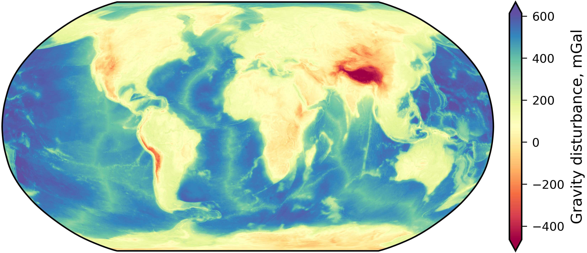

# Compute a _Global Bouguer Disturbance_ using SH global gravity models and SHTOOLS

 hosted on [Pangeo's](https://pangeo.io/) BinderHub [binder.pangeo.io](https://binder.pangeo.io/)

The [`ggm_bg.ipynb`](./ggm_bg.ipynb) Jupyter Notebook in this repository presents a procedure to obtain a global map of the *topography-reduced gravity disturbance* (or *complete Bouguer disturbance*, or *No Ellipsoidal Topography of Constant density (NETC) disturbance*), starting from the spherical harmonics coefficients of a global gravity field model and a synthetic model of the gravity effect of topography, ice, and water.  It relies on [SHTOOLS](https://shtools.oca.eu/shtools/public/) (Wieczorek and Meschede, 2018, [doi:10.1029/2018GC007529](https://doi.org/10.1029/2018GC007529)), using _pyshtools_ functions and classes ([link to documentation](https://shtools.github.io/SHTOOLS/index.html)).

It was set up to try SHTOOLS out of curiosity, to get familiar with Jupyter notebooks and their deployment on Binder, and, to successfully compute a Bouguer disturbance using global gravity models, which *should* be a trivial task. The operation which we perform here follows the definition in Eq. 33 of ICGEM report [STR09/02](https://doi.org/10.2312/GFZ.b103-0902-26).

This notebook was set up with the following gravity models, downloaded in the gfc format from [ICGEM](http://icgem.gfz-potsdam.de/home):

* Input global gravity model: **XGM2019e**, Zingerle, P., Pail, R., Gruber, T., Oikonomidou, X. (2019): The experimental gravity field model XGM2019e. *GFZ Data Services*. [doi:10.5880/ICGEM.2019.007](http://doi.org/10.5880/ICGEM.2019.007).

* Topographic effect model: **dV_ELL_Earth2014**, Rexer, M., Hirt, C., Claessens, S., Tenzer, R. (2016): Layer-based modelling of the Earth's gravitational potential up to 10km-scale in spherical harmonics in spherical and ellipsoidal approximation. *Surveys in Geophysics*. [doi:10.1007/s10712-016-9382-2](https://doi.org/10.1007/s10712-016-9382-2).

When deployed in a BinderHub instance, these two models are downloaded and unzipped after the container is built, using the [`PostBuild`](./binder/postBuild) script provided in this repository.
If run locally, `PostBuild` must be run beforehand and the downloaded files moved accordingly.
In alternative, the argument of `read_icgem_gfc` may be edited with the correct path (an url to the gfc or zipped gfc may be also provided).
The code should work with any other combination of models. Note that using models expressed to a different maximum spherical harmonics degree may lead to unconsistencies (if the maximum degree of the two models differ, the model with the lower one gets zero-padded to the higher one).
Note that the topographic effect model used in the example does not include the normal potential.

#### ⚠️ Disclaimer
Keep in mind that this example deals with computing a *topography-reduced gravity disturbance*, as described in Eq. 33 of [STR09/02](https://doi.org/10.2312/GFZ.b103-0902-26), using SHTOOLS and gfc files downloaded from ICGEM. 
Its aim is keeping formal consistency in the computation - a trivial task, albeit prone to errors.
Apart from this, for this purposes, any other issue was deemed of secondary importance (to a reasonable extent). Thus I must warn against using the 'Bouguer disturbance' here obtained in any application.

#### License
The contents of this repository is licensed under the Mozilla Public License 2.0 - see the [LICENSE](LICENSE) file for details.
The coefficients of the cited models are downloaded at build time, no part of them being stored in this repository.
